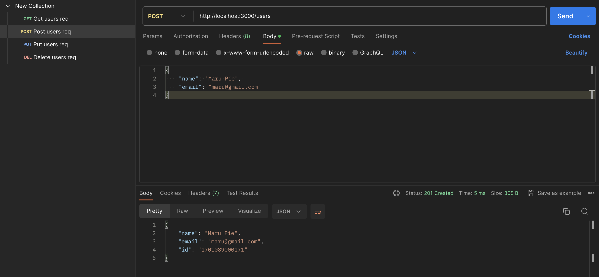
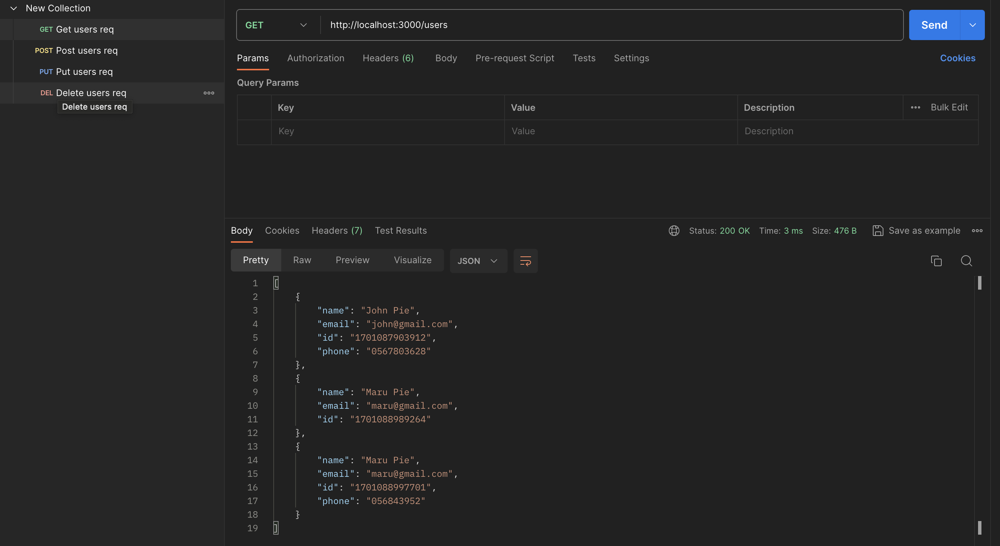
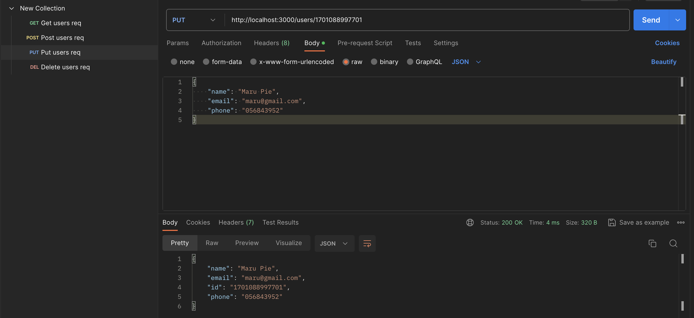
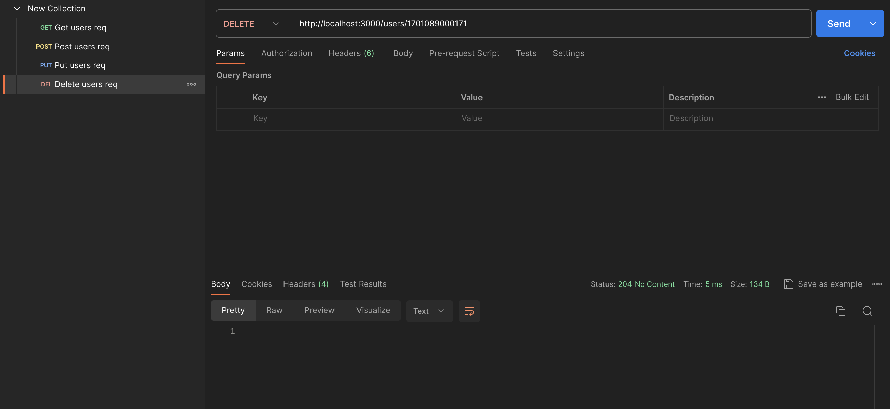

# Node.js User Management API

Этот проект представляет собой простой API для управления пользователями, реализованный на Node.js с использованием Express и Joi для валидации данных.

## Особенности

- CRUD операции для управления пользователями.
- Валидация данных с помощью Joi.
- Хранение данных пользователей в файле JSON.

## Требования

- Node.js
- NPM

## Установка

Склонируйте репозиторий и установите зависимости:

```bash
git clone [https://github.com/mariarchie/NodeJS4]
cd NodeJS4
npm install
```

## Запуск приложения

Запустите сервер командой:

```bash
node index.js
```

## API Endpoints

В приложении доступны следующие эндпоинты:

### POST /users

**Описание**: Создание пользователя.



### GET /users

**Описание**: Получение списка всех пользователей.




### PUT /users/:id

**Описание**: Обновление данных пользователя по ID.




### DELETE /users/:id

**Описание**: Удаление пользователя по ID.



## Структура проекта

- `index.js`: Точка входа в приложение.
- `userRoutes.js`: Маршруты для обработки запросов к пользователям.
- `users.json`: Файл для хранения данных пользователей.

## Валидация

Валидация входящих данных осуществляется с помощью Joi. Схема валидации определена в `userRoutes.js`.


